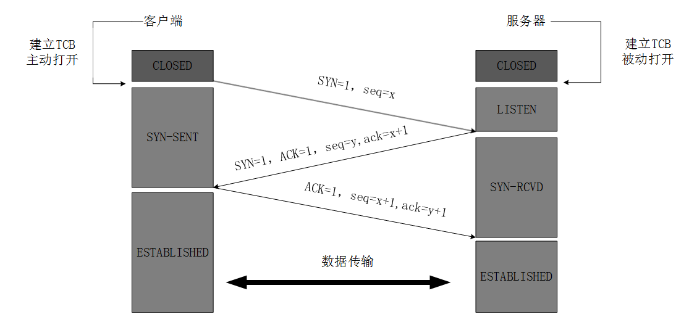

- [Computer Network](#computer-network)
  - [三次握手](#三次握手)
    - [原理](#原理)
    - [为什么客户端一定要发送一个确认报文呢](#为什么客户端一定要发送一个确认报文呢)
  - [四次挥别](#四次挥别)
    - [原理](#原理-1)
    - [为什么要等待2MSL时间](#为什么要等待2msl时间)
  - [如果已经建立了连接，但是客户端突然出现故障了怎么办](#如果已经建立了连接但是客户端突然出现故障了怎么办)
  - [host1和host2在一个子网和在不同的子网下面，目的mac地址是一样的吗？](#host1和host2在一个子网和在不同的子网下面目的mac地址是一样的吗)

# Computer Network

## 三次握手

> Ref: https://blog.csdn.net/qzcsu/article/details/72861891

### 原理

在没有建立连接的状态下，Client是CLOSED状态，Server是LISTEN（监听）状态。

第一次握手：客户端初始化seq=x，在报文首部设置SYN=1。TCP进入SYN-SENT。不能携带数据。

第二次握手：服务器接收到请求并同意连接，初始化序号y，在报文首部设置SYN=1和ACK=1，ack=x+1。服务器进入SYN-RCVD状态。不能携带数据。（规律：SYN=1时均不可携带数据）

第三次握手：客户端接收请求后，本次seq=x+1，在报文首部设置ACK=1，ack=y+1。客户端进入ESTABLISHED状态。可以携带数据。

服务器接收到客户端请求后进入ESTABLISHED状态，数据就可以正常传输了。

### 为什么客户端一定要发送一个确认报文呢

是为了防止二次连接，客户端第一次发送了一个请求连接的报文A，但是网络拥挤导致该报文迟迟未到。这时在客户端视角下由于没有收到服务端的回应，所以认为报文已丢失（但有可能没有丢失），因此会在此发送请求报文B，这时请求报文B到达且顺利建立连接直至关闭。随后报文A到达，在服务器的视角中会认为这时客户端发来的第二次连接请求，所以会发送确认报文。如果不是三次握手，那么服务器直接会转换为ESTABLISHED状态，而客户端会意识到这个连接已经关闭，后续就不会发送任何请求了，那么服务器的资源就被占用，直至超时关闭连接，浪费资源。如果启用了三次握手，那么服务器会转换为SYN-RCVD状态，那么客户端不发送数据后，客户端就会认为这个请求失效了，会自动释放连接。

## 四次挥别

> Ref: https://blog.csdn.net/qzcsu/article/details/72861891

### 原理

这是客户端发送完数据向服务器进行挥别。

第一次挥别：客户端不需要发送更多数据。客户端设置报文首部FIN=1，seq=u（等于前面已经传送过来的数据的最后一个字节的序号加1）。客户端进入FIN-WAIT-1。

第二次挥别：服务器收到请求，知道客户端没有数据发送了，但是服务器端可能还需要发送数据。所以服务器发送确认报文，设置报文首部ACK=1, ack=u+1, seq=v。服务器进入CLOSE-WAIT状态。

服务器传输数据。

第三次挥别：服务器不需要发送更多数据了。服务器设置报文首部FIN=1, ACK=1, seq=w, **ack=u+1**。服务器进入LAST-ACK状态。

第四次挥别：客户端收到服务器的连接释放报文后，必须发出确认，ACK=1，ack=w+1，而自己的序列号是seq=u+1，此时，客户端就进入了TIME-WAIT（时间等待）状态。注意此时TCP连接还没有释放，必须经过2*MSL（最长报文段寿命）的时间后，当客户端撤销相应的TCB后，才进入CLOSED状态。

服务器收到确认后立即转化为CLOSED状态。

### 为什么要等待2MSL时间

第一，保证客户端发送的最后一个ACK报文能够到达服务器，因为这个ACK报文可能丢失，**站在服务器的角度看来，我已经发送了FIN+ACK报文请求断开了，客户端还没有给我回应，应该是我发送的请求断开报文它没有收到**，于是服务器又会重新发送一次，而客户端就能在这个2MSL时间段内收到这个重传的报文，接着给出回应报文，并且会重启2MSL计时器。

第二，防止类似与“三次握手”中提到了的“已经失效的连接请求报文段”出现在本连接中。客户端发送完最后一个确认报文后，在这个2MSL时间中，就可以使本连接持续的时间内所产生的所有报文段都从网络中消失。这样新的连接中不会出现旧连接的请求报文。

## 如果已经建立了连接，但是客户端突然出现故障了怎么办

TCP还设有一个保活计时器，显然，客户端如果出现故障，服务器不能一直等下去，白白浪费资源。服务器每收到一次客户端的请求后都会重新复位这个计时器，时间通常是设置为2小时，若两小时还没有收到客户端的任何数据，服务器就会发送一个探测报文段，以后每隔75秒发送一次。若一连发送10个探测报文仍然没反应，服务器就认为客户端出了故障，接着就关闭连接。

## host1和host2在一个子网和在不同的子网下面，目的mac地址是一样的吗？

不一样，在一个子网内会直接通过ARP协议找到目标MAC地址，而在不同子网下
