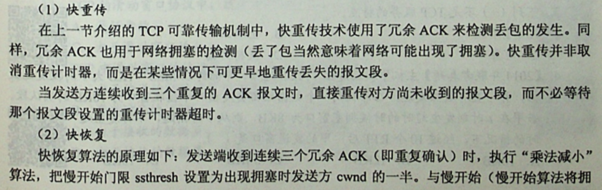
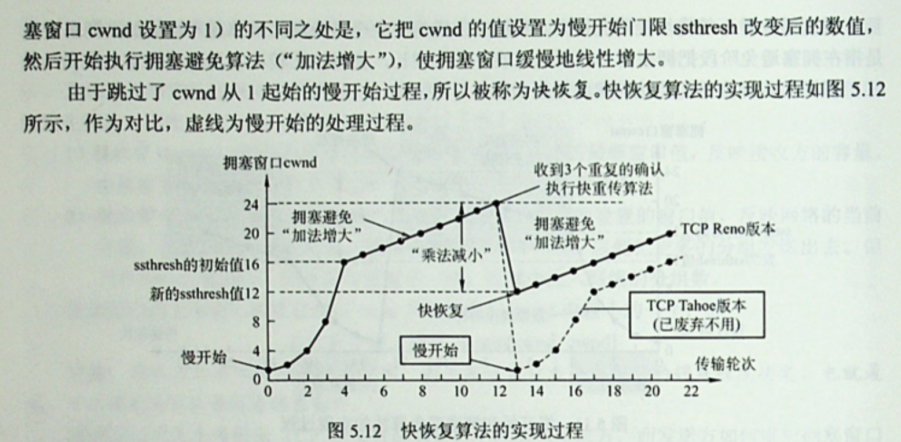

- [Computer Network](#computer-network)
  - [三次握手](#三次握手)
    - [原理](#原理)
    - [为什么客户端一定要发送一个确认报文呢](#为什么客户端一定要发送一个确认报文呢)
  - [四次挥别](#四次挥别)
    - [原理](#原理-1)
    - [为什么要等待2MSL时间](#为什么要等待2msl时间)
  - [如果已经建立了连接，但是客户端突然出现故障了怎么办](#如果已经建立了连接但是客户端突然出现故障了怎么办)
  - [host1和host2在一个子网和在不同的子网下面，目的mac地址是一样的吗？](#host1和host2在一个子网和在不同的子网下面目的mac地址是一样的吗)
  - [OSI七层模型](#osi七层模型)
    - [工作设备](#工作设备)
    - [遵循下列原则](#遵循下列原则)
  - [tcp/ip的分片](#tcpip的分片)
    - [ip数据报的分片](#ip数据报的分片)
    - [分片后，第一个报文和第二个报文的头部有什么区别](#分片后第一个报文和第二个报文的头部有什么区别)
      - [ip数据报头中的片偏移量和tcp数据报头中片偏移量的区别](#ip数据报头中的片偏移量和tcp数据报头中片偏移量的区别)
  - [TCP/IP相关协议](#tcpip相关协议)
    - [DHCP协议工作原理](#dhcp协议工作原理)
    - [ICMP协议](#icmp协议)
  - [DNS协议](#dns协议)
  - [TCP vs UDP](#tcp-vs-udp)
  - [HTTP 协议](#http-协议)
    - [在浏览器输入URI后的事件](#在浏览器输入uri后的事件)
    - [HTTP的特点](#http的特点)
    - [HTTP报文](#http报文)
  - [TCP如何保证传输的](#tcp如何保证传输的)
  - [对称加密 VS 非对称加密](#对称加密-vs-非对称加密)
    - [对称加密算法](#对称加密算法)
    - [非对称加密算法](#非对称加密算法)
    - [Hash算法（摘要算法）](#hash算法摘要算法)
    - [HTTPS 加密原理](#https-加密原理)
  - [TCP拥塞控制原理](#tcp拥塞控制原理)
    - [慢开始和拥塞避免](#慢开始和拥塞避免)
    - [快重传与快恢复](#快重传与快恢复)

# Computer Network

## 三次握手

> Ref: https://blog.csdn.net/qzcsu/article/details/72861891

### 原理


在没有建立连接的状态下，Client是CLOSED状态，Server是LISTEN（监听）状态。

第一次握手：客户端初始化seq=x，在报文首部设置SYN=1。TCP进入SYN-SENT。不能携带数据。

第二次握手：服务器接收到请求并同意连接，初始化序号y，在报文首部设置SYN=1和ACK=1，ack=x+1。服务器进入SYN-RCVD状态。不能携带数据。（规律：SYN=1时均不可携带数据）

第三次握手：客户端接收请求后，本次seq=x+1，在报文首部设置ACK=1，ack=y+1。客户端进入ESTABLISHED状态。可以携带数据。

服务器接收到客户端请求后进入ESTABLISHED状态，数据就可以正常传输了。

### 为什么客户端一定要发送一个确认报文呢

是为了防止二次连接，客户端第一次发送了一个请求连接的报文A，但是网络拥挤导致该报文迟迟未到。这时在客户端视角下由于没有收到服务端的回应，所以认为报文已丢失（但有可能没有丢失），因此会在此发送请求报文B，这时请求报文B到达且顺利建立连接直至关闭。随后报文A到达，在服务器的视角中会认为这时客户端发来的第二次连接请求，所以会发送确认报文。如果不是三次握手，那么服务器直接会转换为ESTABLISHED状态，而客户端会意识到这个连接已经关闭，后续就不会发送任何请求了，那么服务器的资源就被占用，直至超时关闭连接，浪费资源。如果启用了三次握手，那么服务器会转换为SYN-RCVD状态，那么客户端不发送数据后，客户端就会认为这个请求失效了，会自动释放连接。

## 四次挥别

> Ref: https://blog.csdn.net/qzcsu/article/details/72861891

### 原理


这是客户端发送完数据向服务器进行挥别。

第一次挥别：客户端不需要发送更多数据。客户端设置报文首部FIN=1，seq=u（等于前面已经传送过来的数据的最后一个字节的序号加1）。客户端进入FIN-WAIT-1。

第二次挥别：服务器收到请求，知道客户端没有数据发送了，但是服务器端可能还需要发送数据。所以服务器发送确认报文，设置报文首部ACK=1, ack=u+1, seq=v。服务器进入CLOSE-WAIT状态。

服务器传输数据。

第三次挥别：服务器不需要发送更多数据了。服务器设置报文首部FIN=1, ACK=1, seq=w, **ack=u+1**。服务器进入LAST-ACK状态。

第四次挥别：客户端收到服务器的连接释放报文后，必须发出确认，ACK=1，ack=w+1，而自己的序列号是seq=u+1，此时，客户端就进入了TIME-WAIT（时间等待）状态。注意此时TCP连接还没有释放，必须经过2*MSL（最长报文段寿命）的时间后，当客户端撤销相应的TCB后，才进入CLOSED状态。

服务器收到确认后立即转化为CLOSED状态。

### 为什么要等待2MSL时间

第一，保证客户端发送的最后一个ACK报文能够到达服务器，因为这个ACK报文可能丢失，**站在服务器的角度看来，我已经发送了FIN+ACK报文请求断开了，客户端还没有给我回应，应该是我发送的请求断开报文它没有收到**，于是服务器又会重新发送一次，而客户端就能在这个2MSL时间段内收到这个重传的报文，接着给出回应报文，并且会重启2MSL计时器。

第二，防止类似与“三次握手”中提到了的“已经失效的连接请求报文段”出现在本连接中。客户端发送完最后一个确认报文后，在这个2MSL时间中，就可以使本连接持续的时间内所产生的所有报文段都从网络中消失。这样新的连接中不会出现旧连接的请求报文。


## 如果已经建立了连接，但是客户端突然出现故障了怎么办

TCP还设有一个保活计时器，显然，客户端如果出现故障，服务器不能一直等下去，白白浪费资源。服务器每收到一次客户端的请求后都会重新复位这个计时器，时间通常是设置为2小时，若两小时还没有收到客户端的任何数据，服务器就会发送一个探测报文段，以后每隔75秒发送一次。若一连发送10个探测报文仍然没反应，服务器就认为客户端出了故障，接着就关闭连接。

## host1和host2在一个子网和在不同的子网下面，目的mac地址是一样的吗？

不一样，在一个子网内会直接通过ARP协议找到目标MAC地址，而在不同子网下

## OSI七层模型
OSI中的层 功能 TCP/IP协议族
应用层 文件传输，电子邮件，文件服务，虚拟终端 TFTP，HTTP，SNMP，FTP，SMTP，DNS，Telnet
表示层 数据格式化，代码转换，数据加密 没有协议
会话层 解除或建立与别的接点的联系 没有协议
传输层 提供端对端的接口 TCP，UDP
网络层 为数据包选择路由 IP，ICMP，RIP，OSPF，BGP，IGMP
数据链路层 传输有地址的帧以及错误检测功能 SLIP，CSLIP，PPP，ARP，RARP，MTU
物理层 以二进制数据形式在物理媒体上传输数据 ISO2110，IEEE802，IEEE802.2

### 工作设备
物理层：中继器、集线器、还有我们通常说的双绞线也工作在物理层
数据链路层：网桥（现已很少使用）、以太网交换机（二层交换机）、网卡（其实网卡是一半工作在物理层、一半工作在数据链路层）
网络层：路由器、三层交换机
传输层：四层交换机、也有工作在四层的路由器

### 遵循下列原则
1、同一层中的各网络节点都有相同的层次结构，具有同样的功能。
2、同一节点内相邻层之间通过接口（可以是逻辑接口）进行通信。
3、七层结构中的每一层使用下一层提供的服务，并且向其上层提供服务。
4、不同节点的同等层按照协议实现对等层之间的通信。


## tcp/ip的分片

### ip数据报的分片
——"tcp/ip的分片，MTU，MSS，tcp报文的分片，tcp2000字节，分片后，第一个报文和第二个报文的头部有什么区别"


MTU： Maximum Transmit Unit，最大传输单元，即物理接口（数据链路层）提供给其上层（通常是IP层）最大一次传输数据的大小；以普遍使用的以太网接口为例，缺省MTU=1500 Byte，这是以太网接口对IP层的约束，如果IP层有<=1500 byte 需要发送，只需要一个IP包就可以完成发送任务；如果IP层有> 1500 byte 数据需要发送，需要分片才能完成发送，这些分片有一个共同点，即IP Header ID相同。

MSS：Maximum Segment Size ，TCP提交给IP层最大分段大小，不包含TCP Header和 TCP Option，只包含TCP Payload ，MSS是TCP用来限制application层最大的发送字节数。如果底层物理接口MTU= 1500 byte，则 MSS = 1500- 20(IP Header) -20 (TCP Header) = 1460 byte，如果application 有2000 byte发送，需要两个segment才可以完成发送，第一个TCP segment = 1460，第二个TCP segment = 540。

### 分片后，第一个报文和第二个报文的头部有什么区别
主要答出第二个报文MF为0，ip数据报头（注意不是tcp数据报头）的片偏移量第一个为0，第二个为1480/8

#### ip数据报头中的片偏移量和tcp数据报头中片偏移量的区别
tcp数据报

ip数据报


## TCP/IP相关协议
### DHCP协议工作原理
注意DHCP全程都是是广播


### ICMP协议
差错控制报文

询问报文


## DNS协议


## TCP vs UDP


## HTTP 协议

### 在浏览器输入URI后的事件


### HTTP的特点
1.无状态：服务器不会记得其服务过某个客户多少次，每一次相应都是相同的。

2.本身是无连接的：但使用TCP作为传输协议，通讯双方在交换HTTP报文前不需要HTTP连接

3.持久连接 vs 非持久连接


### HTTP报文
HTTP报文分为两类：
请求报文：从客户向服务器发送的请求报文
响应报文：从服务器到客户的回答

## TCP如何保证传输的

TCP协议保证数据传输可靠性的方式主要有：

校验和
序列号
确认应答
超时重传
连接管理
流量控制
拥塞控制

> Ref: https://blog.csdn.net/liuchenxia8/article/details/80428157


## 对称加密 VS 非对称加密

### 对称加密算法

对称加密算法: 密钥较短，破译困难，除了数据加密标准（DES），另一个对称密钥加密系统是国际数据加密算法（IDEA），它比DES的加密性好，且对计算机性能要求也没有那么高.

优点:

    算法公开、计算量小、加密速度快、加密效率高

缺点:

    在数据传送前，发送方和接收方必须商定好秘钥，然后 使双方都能保存好秘钥。其次如果一方的秘钥被泄露，那么加密信息也就不安全了。另外，每对用户每次使用对称加密算法时，都需要使用其他人不知道的唯一秘钥，这会使得收、发双方所拥有的钥匙数量巨大，密钥管理成为双方的负担。

常见的对称加密算法有: DES、3DES、Blowfish、IDEA、RC4、RC5、RC6 和 AES 

### 非对称加密算法

非对称加密算法: 公开密钥与私有密钥是一对，如果用公开密钥对数据进行加密，只有用对应的私有密钥才能解密；如果用私有密钥对数据进行加密，那么只有用对应的公开密钥才能解密。因为加密和解密使用的是两个不同的密钥，所以这种算法叫作非对称加密算法。

非对称加密算法实现机密信息交换的基本过程是：甲方生成一对密钥并将其中的一把作为公用密钥向其它方公开；得到该公用密钥的乙方使用该密钥对机密信息进行加密后再发送给甲方；甲方再用自己保存的另一把专用密钥对加密后的信息进行解密。甲方只能用其专用密钥解密由其公用密钥加密后的任何信息。

优点:

    安全

缺点:

    速度较慢

常见的非对称加密算法有: RSA、ECC（移动设备用）、Diffie-Hellman、El Gamal、DSA（数字签名用）

### Hash算法（摘要算法）

Hash算法特别的地方在于它是一种单向算法，用户可以通过hash算法对目标信息生成一段特定长度的唯一hash值，却不能通过这个hash值重新获得目标信息。因此Hash算法常用在不可还原的密码存储、信息完整性校验等。

常见的摘要算法有: MD2、MD4、MD5、HAVAL、SHA


### HTTPS 加密原理

HTTPS在传输的过程中会涉及到三个密钥：
```
服务器端的公钥和私钥，用来进行非对称加密

客户端生成的随机密钥，用来进行对称加密
```
一个HTTPS请求实际上包含了两次HTTP传输，可以细分为8步。

1.客户端向服务器发起HTTPS请求，连接到服务器的443端口

2.服务器端有一个密钥对，即公钥和私钥，是用来进行非对称加密使用的，服务器端保存着私钥，不能将其泄露，公钥可以发送给任何人。

3.服务器将自己的公钥发送给客户端。

4.客户端收到服务器端的证书之后，会对证书进行检查，验证其合法性，如果发现发现证书有问题，那么HTTPS传输就无法继续。如果公钥合格，那么客户端会生成一个随机值，这个随机值就是用于进行对称加密的密钥，我们将该密钥称之为client key，即客户端密钥，这样在概念上和服务器端的密钥容易进行区分。然后用服务器的公钥对客户端密钥进行非对称加密，这样客户端密钥就变成密文了，至此，HTTPS中的第一次HTTP请求结束。

5.客户端会发起HTTPS中的第二个HTTP请求，将加密之后的客户端密钥发送给服务器。

6.服务器接收到客户端发来的密文之后，会用自己的私钥对其进行非对称解密，解密之后的明文就是客户端密钥，然后用客户端密钥对数据进行对称加密，这样数据就变成了密文。

7.然后服务器将加密后的密文发送给客户端。

8.客户端收到服务器发送来的密文，用客户端密钥对其进行对称解密，得到服务器发送的数据。这样HTTPS中的第二个HTTP请求结束，整个HTTPS传输完成。


## TCP拥塞控制原理

### 慢开始和拥塞避免


图示：


### 快重传与快恢复  

