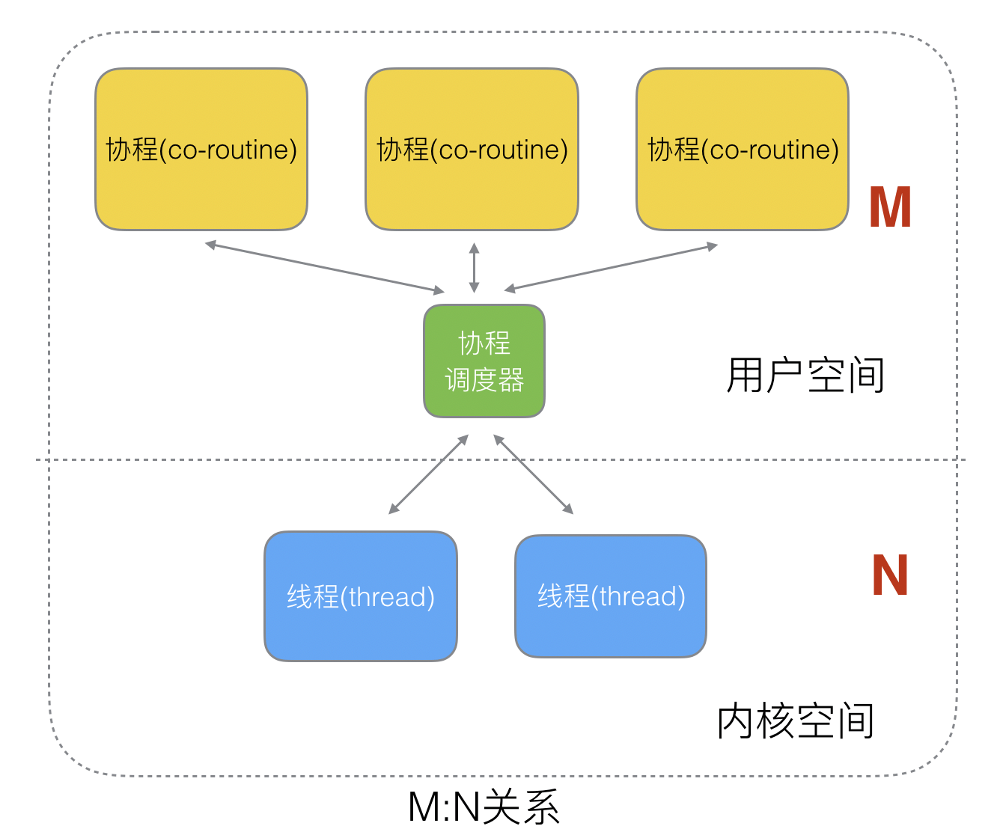
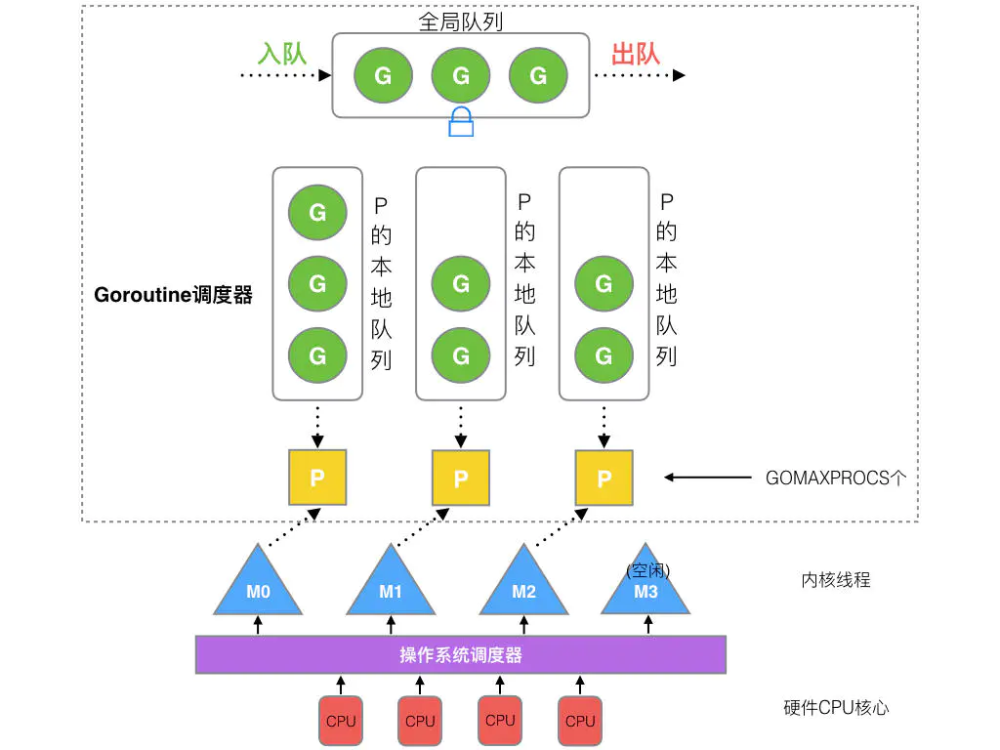
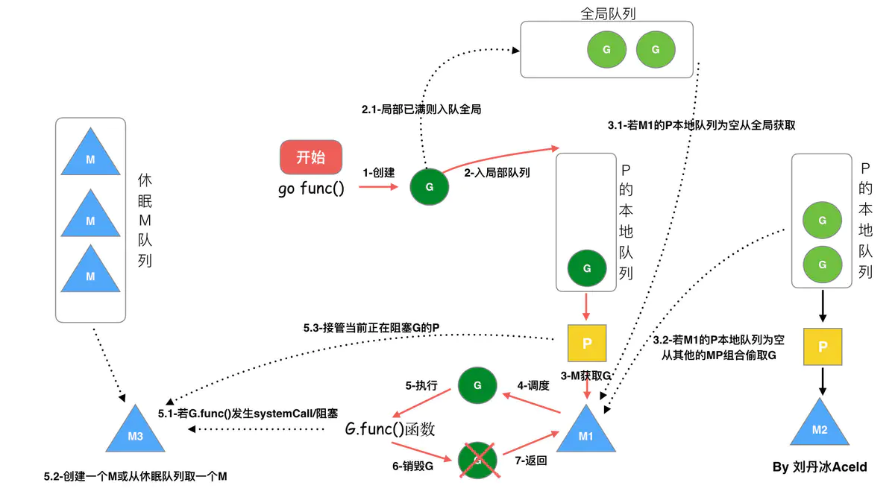
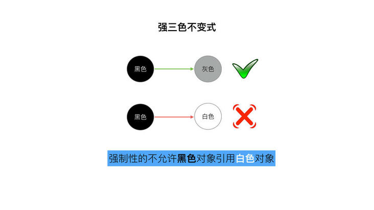
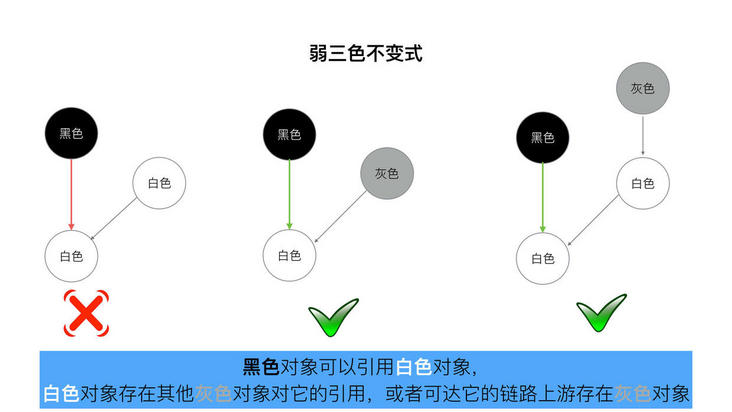
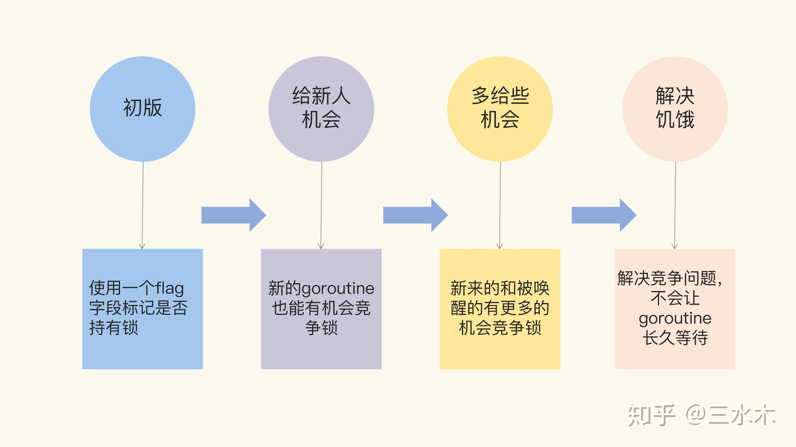
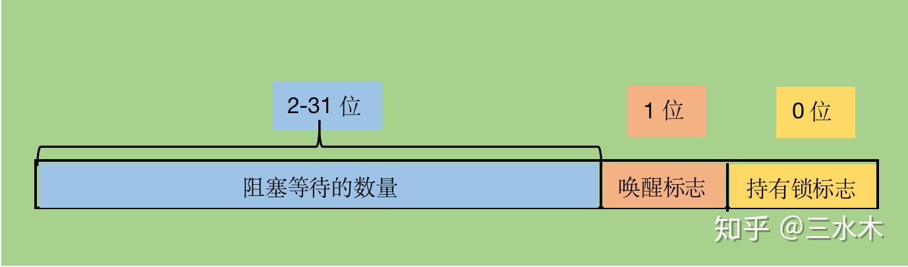
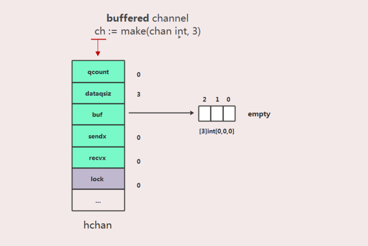

- [GoLang](#golang)
	- [GMP模型](#gmp模型)
		- [用户线程和系统线程的区别](#用户线程和系统线程的区别)
		- [GMP单独介绍](#gmp单独介绍)
		- [P和M的数量](#p和m的数量)
		- [P和M是什么时候被创建的](#p和m是什么时候被创建的)
		- [调度器的设计策略](#调度器的设计策略)
		- [调度流程](#调度流程)
	- [协程交替打印1-20](#协程交替打印1-20)
		- [使用channel](#使用channel)
		- [使用锁](#使用锁)
	- [Golang GC](#golang-gc)
		- [堆和栈](#堆和栈)
		- [设计原理](#设计原理)
			- [标记清除](#标记清除)
			- [三色抽象](#三色抽象)
				- [不足](#不足)
			- [屏障机制](#屏障机制)
			- [混合写屏障(Go 1.8+)](#混合写屏障go-18)
	- [Mutex的实现原理](#mutex的实现原理)
		- [信号量](#信号量)
		- [V1](#v1)
		- [V2](#v2)
		- [V3](#v3)
		- [V4](#v4)
	- [Channel机制](#channel机制)
		- [hchan](#hchan)

# GoLang

## GMP模型

> Refs:
> - https://www.programmersought.com/article/98681581962/
> - https://www.jianshu.com/p/fa696563c38a
> - https://blog.csdn.net/u010182186/article/details/77473547

### 用户线程和系统线程的区别

**系统线程**是由内核控制，当线程进行切换的时候，由用户态转化为内核态，切换完毕要从内核态返回用户态，可以利用多核CPU。**用户线程**内核的切换由用户态程序自己控制内核切换,不需要内核干涉，少了进出内核态的消耗，但不能很好的利用多核CPU。



为了既利用系统线程对于多核心CPU的优化，又为了使用用户线程的轻量级进程切换，因此Golang使用协程调度器来实现上述要求。

### GMP单独介绍

G是GoRoutine的缩写，包含函数执行指令和一些参数，比如任务对象、线程上下文切换、必须的寄存器的字段保护和恢复（field protection and field recovery required registers）等。

M是一个线程(thread)或者机器(machine)的缩写，所有的线程共享一个线程栈，如果你没有给线程栈分配内存，系统会自动分配内存。一个M中，包括一个指向g的指针，一个sp指针和一个pc指针，分别用户现场保护和现场恢复。当线程栈被指定后，G.stack = M.stack，且M的PC寄存器会指向G提供的函数，然后执行该函数。

P是一个抽象的概念，不代表一个真正的CPU核心。P会创建或者唤醒一个系统线程去执行队列中的任务。P决定同时并行(simultaneous concurrent)的任务数量，`GOMAXPROCS`限制了操作系统线程，它可以同时执行用户级任务。



Goroutine调度器和OS调度器是通过M结合起来的，每个M都代表了1个内核线程，OS调度器负责把内核线程分配到CPU的核上执行。

### P和M的数量

P的数量理论上是不限制的，但是实际情况下P的数量最好与核心数相同。而M的数量在Golang中最大限制为10000，但是在实际使用中则通过runtime提供的`SetMaxThreads()`方法来设置。

### P和M是什么时候被创建的

在确定了几个P之后P立即被创建，M是则是采用懒加载的方案。

### 调度器的设计策略

复用线程：避免频繁的创建、销毁线程，而是对线程的复用。
- work stealing机制: 当本线程无可运行的G时，尝试从其他线程绑定的P偷取G，而不是销毁线程。
- hand off机制: 当本线程因为G进行系统调用阻塞时，线程释放绑定的P，把P转移给其他空闲的线程执行。

利用并行：GOMAXPROCS设置P的数量，最多有GOMAXPROCS个线程分布在多个CPU上同时运行。GOMAXPROCS也限制了并发的程度，比如GOMAXPROCS = 核数/2，则最多利用了一半的CPU核进行并行。

抢占：在coroutine中要等待一个协程主动让出CPU才执行下一个协程，在Go中，一个goroutine最多占用CPU 10ms，防止其他goroutine被饿死，这就是goroutine不同于coroutine的一个地方。

全局G队列：在新的调度器中依然有全局G队列，但功能已经被弱化了，当M执行work stealing从其他P偷不到G时，它可以从全局G队列获取G。

### 调度流程



## 协程交替打印1-20

### 使用channel

> Ref: https://blog.csdn.net/Gusand/article/details/99442113

```go
package main

import (
	"fmt"
)

func main() {
	A := make(chan bool, 1)
	B := make(chan bool)
	Exit := make(chan bool)

	go func() {
		for i := 0; i < 20; i++ {
			if i%2 != 0 {
				continue
			}
			if ok := <-A; ok {
				fmt.Println(i)
				B <- true
			}
		}
	}()

	go func() {
		defer func() {
			close(Exit)
		}()
		for i := 0; i < 20; i++ {
			if i%2 == 0 {
				continue
			}
			if ok := <-B; ok {
				fmt.Println(i)
				A <- true
			}
		}
	}()

	A <- true
	<-Exit
}
```

### 使用锁

> Ref: https://draveness.me/golang/docs/part3-runtime/ch06-concurrency/golang-sync-primitives/#mutex

```go
package main

import (
	"fmt"
	"sync"
)

func main() {
	var oddMut sync.Mutex
	var evenMut sync.Mutex
	var wg sync.WaitGroup

	oddMut.Lock()
	wg.Add(2)

	go func() {
		defer wg.Done()
		for i := 0; i < 20; i++ {
			if i%2 != 0 {
				continue
			}
			evenMut.Lock()
			fmt.Println(i)
			oddMut.Unlock()
		}
	}()

	go func() {
		defer wg.Done()
		for i := 0; i < 20; i++ {
			if i%2 == 0 {
				continue
			}
			oddMut.Lock()
			fmt.Println(i)
			evenMut.Unlock()
		}
	}()

	wg.Wait()
}
```

## Golang GC

> Refs: 
> - [垃圾收集器](https://draveness.me/golang/docs/part3-runtime/ch07-memory/golang-garbage-collector/)
> - [C/C++的内存分配？栈和堆的区别？为什么栈快？](https://blog.csdn.net/baidu_37964071/article/details/81428139)
> - [Golang三色标记、混合写屏障GC模式图文全分析](https://segmentfault.com/a/1190000022030353)
> - [golang 垃圾回收（一）概述](https://liqingqiya.github.io/golang/gc/%E5%9E%83%E5%9C%BE%E5%9B%9E%E6%94%B6/2020/06/02/gc1.html)
> - [golang 垃圾回收（二）屏障技术](https://liqingqiya.github.io/golang/gc/%E5%9E%83%E5%9C%BE%E5%9B%9E%E6%94%B6/2020/06/02/gc2.html)
> - [golang 垃圾回收（三）插入写屏障](https://liqingqiya.github.io/golang/gc/%E5%9E%83%E5%9C%BE%E5%9B%9E%E6%94%B6/2020/06/03/gc3.html)
> - [golang 垃圾回收（四）删除写屏障](https://liqingqiya.github.io/golang/gc/%E5%9E%83%E5%9C%BE%E5%9B%9E%E6%94%B6/2020/06/13/gc4.html)
> - [golang 垃圾回收（五）混合写屏障](https://liqingqiya.github.io/golang/gc/%E5%9E%83%E5%9C%BE%E5%9B%9E%E6%94%B6/%E5%86%99%E5%B1%8F%E9%9A%9C/2020/07/24/gc5.html)

### 堆和栈

栈区(stack)由编译器自动分配释放，存放为运行函数而分配的局部变量、函数参数、返回数据、返回地址等。其操作方式类似于数据结构中的栈；

堆区(heap)一般由程序员分配释放，若程序员不释放，程序结束时可能由OS回收。分配方式类似于链表。

### 设计原理


用户程序（Mutator）会通过内存分配器（Allocator）在**堆**上申请内存，而垃圾收集器（Collector）负责回收堆上的内存空间，内存分配器和垃圾收集器**共同管理**着程序中的堆内存空间。

#### 标记清除

顾名思义，分为标记（Mark）和清除（Sweep）两个阶段：

- 标记阶段：从根对象出发查找并标记堆中所有存活的对象；
- 清除阶段：遍历堆中的全部对象，回收未被标记的垃圾对象并将回收的内存加入空闲链表。

从根对象出发依次遍历对象的子对象并将从根节点可达的对象都标记成**存活状态**，不可达的标记为**垃圾**。如下图A是根，CD都是可达的，BEF都会被标记为垃圾。


标记阶段结束后会进入清除阶段，释放其中没有被标记的BEF三个对象并将新的空闲内存空间**以链表的结构串联**起来，方便内存分配器的使用。

缺点是标记清除阶段需要暂停程序的运行，即STW，需要一种更先进的方法来改进。

#### 三色抽象

为了缩短STW的时间，Golang使用三种颜色标记对象：

- 白色对象：潜在的垃圾，其内存可能会被垃圾收集器回收；
- 黑色对象：活跃的对象，包括不存在任何引用外部指针的对象以及从根对象可达的对象；
- 灰色对象：活跃的对象，因为存在指向白色对象的外部指针，垃圾收集器会扫描这些对象的子对象；

这样做的好处是整个GC过程可以以并发的形式来做。


在垃圾收集器开始工作时，程序中不存在任何的黑色对象，垃圾收集的根对象会被标记成灰色，垃圾收集器只会从灰色对象集合中取出对象开始扫描，当灰色集合中不存在任何对象时，标记阶段就会结束，也就是说在标记阶段结束时，只有黑色和白色两种对象。


因为用户程序可能在标记执行的过程中修改对象的指针，所以三色标记清除算法本身是不可以并发或者增量执行的，它仍然需要 STW，在如下所示的三色标记过程中，用户程序建立了从 A 对象到 D 对象的引用，但是因为程序中已经不存在灰色对象了，所以 D 对象会被垃圾收集器错误地回收。


##### 不足

普通的三色抽象机制是需要STW的，否在在同时满足以下条件时三色抽象机制会错误的把不该回收的对象回收：

- 一个白色对象被黑色对象引用(白色被挂在黑色下)
- 灰色对象与它之间的可达关系的白色对象遭到破坏(灰色同时丢了该白色)

但是STW对于性能的影响是非常显著的，因此需要有一种方案既能解决上述问题，而且也不能过多的影响性能。解决思路也非常的简单，即破坏同时满足上述两个条件的可能。因此诞生了屏障机制。

#### 屏障机制

避免上述的问题需要满足的要求是：

- 强三色不变式：不存在黑色对象引用到白色对象的指针；
- 弱三色不变式：所有被黑色对象引用的白色对象都处于灰色保护状态

强三色不变式避免了白色被挂在黑色下，而弱三色不变式保证所有的白色节点还有被扫描到的可能性。

插入写屏障是指**在A对象引用B对象的时候，会将B对象标记为灰色**，即满足了强三色不变式。但是插入屏障仅仅会作用于堆空间，不会作用于栈空间，因为要保证栈的运行效率。在每一阶段的结束后需要一个STW来重新扫描堆空间中的元素。

删除写屏障是指如果被删除的对象自身为白色，那么被标记为灰色。这样做满足弱三色不变式。这种方式不区分栈和堆，而且一个对象即使被删除了最后一个指向它的指针也依旧可以活过这一轮，在下一轮GC中被清理掉。

#### 混合写屏障(Go 1.8+)

目前屏障机制的问题是：

- 插入写屏障：结束时需要STW来重新扫描栈，标记栈上引用的白色对象的存活；
- 删除写屏障：回收精度低，<u>GC开始时STW扫描堆栈来记录初始快照，这个过程会保护开始时刻的所有存活对象。（这个地方我没有理解）</u>

混合写屏障的规则：

- GC开始将栈上的对象全部扫描并标记为黑色(之后不再进行第二次重复扫描，无需STW)；
- **GC期间**，任何在栈上创建的新对象，均为黑色；
- 被删除的对象标记为灰色；
- 被添加的对象标记为灰色。

## Mutex的实现原理

> 看这部分知识前，需要先理解锁的相关知识，详见[Lock](../Lock/lock.md)。
> 
> Refs: 
> - [同步原语与锁](https://draveness.me/golang/docs/part3-runtime/ch06-concurrency/golang-sync-primitives/)
> - [sync.Mutex互斥锁的实现原理](https://segmentfault.com/a/1190000023874384)
> - [golang中的Mutex设计原理详解（一）](https://zhuanlan.zhihu.com/p/339981535)
> - [Go 中的 Mutex 设计原理详解（二）](https://zhuanlan.zhihu.com/p/341887600)
> - [Go 中的 Mutex 设计原理详解（三）](https://zhuanlan.zhihu.com/p/342706674)
> - [Go 中的 Mutex 设计原理详解（四）](https://zhuanlan.zhihu.com/p/344977623)
> - [操作系统之信号量](https://blog.csdn.net/qq_19782019/article/details/79746627)

Go的Mutex结构体构成如下，其中state标志互斥锁的状态，sema标志信号量。以下是Mutex的四个演进过程。



### 信号量

在OS中有P和V操作，P操作是将信号量-1，V操作是将信号量+1，所以信号量的运作方式为：

- 初始化，给与它一个非负数的整数值。
- 程序企图进入临界区块的进程，需要先运行P。
  - 当信号量S减为负值时，进程会被挡住，不能继续，这时该进程被阻塞；
  - 当信号量S不为负值时，进程可以获准进入临界区块。
- 结束离开临界区块的进程，将会运行V。当信号量S不为负值时，先前被挡住的其他进程，将可获准进入临界区块。

### V1

整体代码为

```go
// CAS操作，当时还没有抽象出atomic包
    func cas(val *int32, old, new int32) bool
    func semacquire(*int32)
    func semrelease(*int32)
    // 互斥锁的结构，包含两个字段
    type Mutex struct {
        key  int32 // 锁是否被持有的标识
        sema int32 // 信号量专用，用以阻塞/唤醒goroutine
    }
    
    // 保证成功在val上增加delta的值
    func xadd(val *int32, delta int32) (new int32) {
        for {
            v := *val
            if cas(val, v, v+delta) {
                return v + delta
            }
        }
        panic("unreached")
    }
    
    // 请求锁
    func (m *Mutex) Lock() {
        if xadd(&m.key, 1) == 1 { //标识加1，如果等于1，成功获取到锁
            return
        }
        semacquire(&m.sema) // 否则阻塞等待
    }
    
    func (m *Mutex) Unlock() {
        if xadd(&m.key, -1) == 0 { // 将标识减去1，如果等于0，则没有其它等待者
            return
        }
        semrelease(&m.sema) // 唤醒其它阻塞的goroutine
    }
```

加锁过程本质上是给Mutex.key加1（Mutex.key == 0说明目前没有上锁），所以如果`xadd(&m.key, 1) == 1`说明原先没有上锁，当前进程拿到了锁，如果返回`xadd(&m.key, 1) > 1`，则说明已经上锁，需要调用`semacquire(&m.sema)`使得Goroutine进入等待队列并变为阻塞状态。

解锁操作是加锁操作的逆运算，本质上是对Mutex.key减1，如果`xadd(&m.key, -1) >= 1`，则说明当前有等待者，所以需要利用信号量`semrelease(&m.sema)`唤醒被阻塞的Goroutine，如果`xadd(&m.key, -1) == 0`，则说明当前锁已经无人竞争，意味着该Mutex锁已经解锁。

第一版的弊端是Unlock调用无限制以及Goroutine唤醒效率低下的问题：

Unlock调用无限制这个问题主要是讲的是加锁过程和解锁过程不携带Goroutine信息，也就是说Gorotine A获取的锁，可以被Goroutine B来解锁。即使到第四版，Mutex依然有这个问题，所以要遵循“谁加锁，谁解锁”的设计原则。

Goroutine唤醒效率低下的问题是因为在阻塞队列中唤醒是按照顺序的，但是往往队列中靠前的任务是不占用CPU，因此唤醒这些Goroutine需要进行上下文切换，造成性能浪费。改进方式也非常简单，即让新人（占用CPU的Goroutine）一些机会。

### V2

```go
// A Mutex is a mutual exclusion lock.
// Mutexes can be created as part of other structures;
// the zero value for a Mutex is an unlocked mutex.
type Mutex struct {
    state int32
    sema  uint32
}

const (
	// mutexLocked -> 0x00000000000000000000000000000001 == 1
    mutexLocked = 1 << iota // mutex is locked
	// mutexWoken -> 0x00000000000000000000000000000010 == 2
    mutexWoken
	// mutexWaiterShift -> 2
    mutexWaiterShift = iota
)
```

把原先的计数器key改为state，并在不同的位表示不同的含义。



相比于原来的key字段，多了一个唤醒标志位，同时把是否持有锁以及等待锁的goroutine数量这两个表示进行了一个区分。

加锁操作如下所示，这一版Mutex的核心特点是一个goroutinue被唤醒后，不是立即执行任务，而是仍然重复一遍抢占锁的流程，这样新来的 goroutine 就有机会获取到锁，这就是所谓的给新人机会。

```go
func (m *Mutex) Lock() {
	// Fast path: grab the unlocked mutex
	if atomic.CompareAndSwapInt32(&m.state, 0, mutexLocked) {
		return
	}

	awoke := false
	for {
		// old对应的锁可能有两种状态：
		// 1. 0x???????????????????????????????0 -> 该Mutex已解锁
		// 2. 0x???????????????????????????????1 -> 该Mutex已上锁
		old := m.state
		// new == 0x???????????????????????????????1，最后一位一定是1
		// 因为这行代码在最后要通过CAS方式抢占锁，而抢占锁的标志是持有锁标志为1
		new := old | mutexLocked
		// old == 0x???????????????????????????????1 -> 锁已经被其他的Goroutine占有
		if old & mutexLocked != 0 {
			// 阻塞等待的Goroutine数量+1
			new = old + 1 << mutexWaiterShift
		}
		if awoke {
			// 将new的唤醒标志位清零
			new &^= mutexWoken
		}
		// 尝试通过CAS将old变为new，变化为：1. 加锁 2. 如果锁已经被占用，阻塞等待的Goroutine数量+1
		// 如果这里进不去，那么说明在获取到old之后，别的Goroutine改变了mutex.state
		// 需要继续循环重新获取old
		if atomic.CompareAndSwapInt32(&m.state, old, new) {
			// 通过CAS的方式old变为了new，改变了
			// 1. 阻塞等待数量+1
			// 2. 锁标志变为1

			// old -> 0x???????????????????????????????0（原先无锁）
			// mutexLocked & old == 0
			if old & mutexLocked == 0 {
				// 现在这个Goroutine抢到了
				// 直接退出自旋过程
				break
			}

			// old -> 0x???????????????????????????????1（原先有锁）
			// 阻塞并等待唤醒
			runtime.Semacquire(&m.sema)
			// 唤醒后设置标志位为true
			awoke = true
		}
	}
}
```

解锁操作如下。

```go
func (m *Mutex) Unlock() {
	// new == 0x???????????????????????????????0
	// 目前state == new
	new := atomic.AddInt32(&m.state, -mutexLocked)
	// 如果new不是解锁状态，即new == 0x???????????????????????????????1
	// -> 原先是解锁状态
	// -> new + mutexLocked == 0x???????????????????????????????0
	// -> (new + mutexLocked) & mutexLocked == 0
	// -> panic()
	if (new + mutexLocked) & mutexLocked == 0 {
		panic("sync: unlock of unlocked mutex")
	}
	old := new
	for {
		// old >> mutexWaiterShift == 0 -> 当前无等待Goroutine
		//
		// (mutexLocked | mutexWoken) == 0x00000000000000000000000000000011
		// -> old & (mutexLocked | mutexWoken) != 0 
		// -> 唤醒标志为1（持有锁标志一定为0）
		if old >> mutexWaiterShift == 0 || old & (mutexLocked | mutexWoken) != 0 {
			return
		}
		// (old - 1 << mutexWaiterShift) -> 阻塞等待数量-1
		// (old - 1 << mutexWaiterShift) | mutexWoken -> 唤醒标志位置1
		new = (old - 1 << mutexWaiterShift) | mutexWoken
		// 这次CAS赋值尝试将上面的阻塞等待数量-1和唤醒标志位置1的变化保存到当前m上
		if atomic.CompareAndSwapInt32(&m.state, old, new) {
			// 唤醒一个进程
			runtime.Semrelease(&m.sema)
			// 结束
			return
		}
		old = m.state
	}
}
```

目前看到这里，其实第二版给新人机会已经有了不错的提升，但是它还是有优化空间的。

在加锁解锁的过程中，涉及到频繁的 goroutine 睡眠和唤醒的过程。这个过程涉及到不小的系统开销（可以看一下 runtime.Semacquire 和 runtime.Semrelease 的实现 ）。如果 Lock 和 Unlock 之间的代码耗时很短，那么让新来的 goroutine 或者是醒着的 goroutine 抢占锁失败后，不立即睡眠，而是再尝试几次，说不定就能拿到锁了。尝试一定的次数之后，再进行原有的逻辑。

### V3

大多数时候，协程在独占锁的期间，对数据进行的操作其实耗时很小，比唤醒操作的消耗还小。被唤醒的协程没有抢到锁立刻就沉睡，然后下次还要被再次唤醒，整体上性能是有些浪费的。

上锁过程如下所示。

```go
// Lock locks m.
// If the lock is already in use, the calling goroutine
// blocks until the mutex is available.
func (m *Mutex) Lock() {
    // Fast path: grab unlocked mutex.
    if atomic.CompareAndSwapInt32(&m.state, 0, mutexLocked) {
        if raceenabled {
            raceAcquire(unsafe.Pointer(m))
        }
        return
    }

    awoke := false
    iter := 0
    for {
        old := m.state
        new := old | mutexLocked
		// 锁已经被其他的Goroutine占有
        if old&mutexLocked != 0 {
			// 判断能否自旋（最大自旋次数默认是4）
            if runtime_canSpin(iter) {
                // awoke == false 且 唤醒标志不为1 且 等待Goroutine数量大于0 且 可以通过CAS将唤醒标志置为1
				// 设置awoke为true
                if !awoke && old&mutexWoken == 0 && old>>mutexWaiterShift != 0 &&
                    atomic.CompareAndSwapInt32(&m.state, old, old|mutexWoken) {
                    awoke = true
                }
				// 自旋，其实就是暂停一会
                runtime_doSpin()
				// 自旋次数累加
                iter++
                continue
            }
			// 自旋第5次，需要阻塞了
			// 阻塞Goroutine数量+1
            new = old + 1<<mutexWaiterShift
        }
		// 唤醒标志置0
        if awoke {
            // The goroutine has been woken from sleep,
            // so we need to reset the flag in either case.
            if new&mutexWoken == 0 {
                panic("sync: inconsistent mutex state")
            }
            new &^= mutexWoken
        }
		// 参见V2
        if atomic.CompareAndSwapInt32(&m.state, old, new) {
            if old&mutexLocked == 0 {
                break
            }
            runtime_Semacquire(&m.sema)
            awoke = true
            iter = 0
        }
    }

    if raceenabled {
        raceAcquire(unsafe.Pointer(m))
    }
}
```

### V4

Mutex 演变的四个版本中，第二版和第三版优化的出发点都是性能，尽可能的提升整体的效率。但是具体到单个的协程上，尤其是处于等待队列中的协程，运气不好的话，可能就一直抢不到锁。这就是并发问题中的饥饿现象，也是第四版 Mutex 要解决的问题。


第四版 Mutex 的成员变量 state 的含义相比前两版增加一个饥饿标志位。

```go
const (
	// 0x00000000000000000000000000000001
    mutexLocked = 1 << iota // mutex is locked
	// 0x00000000000000000000000000000010
    mutexWoken
	// 0x00000000000000000000000000000100
    mutexStarving // 从state字段中分出一个饥饿标记
	// 3
    mutexWaiterShift = iota
	// 1,000,000ns = 1ms
	// 表示1ms内如果被唤醒的协程还没有抢到锁，就进入饥饿状态，可以直接获取锁。
    starvationThresholdNs = 1e6
)
```

上锁机制如下。

```go
func (m *Mutex) Lock() {
    // Fast path: 幸运之路，一下就获取到了锁
    if atomic.CompareAndSwapInt32(&m.state, 0, mutexLocked) {
        return
    }
    // Slow path：缓慢之路，尝试自旋竞争或饥饿状态下饥饿goroutine竞争
    m.lockSlow()
}

func (m *Mutex) lockSlow() {
    var waitStartTime int64
    starving := false // 此goroutine的饥饿标记
    awoke := false // 唤醒标记
    iter := 0 // 自旋次数
    old := m.state // 当前的锁的状态
    for {
        // 锁是非饥饿状态，锁还没被释放，尝试自旋
        if old&(mutexLocked|mutexStarving) == mutexLocked && runtime_canSpin(iter) {
			// 如果是非唤醒状态 -> awoke = true 且 唤醒标志置1
            if !awoke && old&mutexWoken == 0 && old>>mutexWaiterShift != 0 &&
                atomic.CompareAndSwapInt32(&m.state, old, old|mutexWoken) {
                awoke = true
            }
            runtime_doSpin()
            iter++
            old = m.state // 再次获取锁的状态，之后会检查是否锁被释放了
            continue
        }
        new := old
        if old&mutexStarving == 0 {
            new |= mutexLocked // 非饥饿状态，加锁
        }
		// 非饥饿状态 && 已被加锁
        if old&(mutexLocked|mutexStarving) != 0 {
            new += 1 << mutexWaiterShift // waiter数量加1
        }
		// 饥饿 && 已被加锁
        if starving && old&mutexLocked != 0 {
            new |= mutexStarving // 设置饥饿状态
        }
        if awoke {
            if new&mutexWoken == 0 {
                throw("sync: inconsistent mutex state")
            }
            new &^= mutexWoken // 新状态清除唤醒标记
        }
        // 成功设置新状态
        if atomic.CompareAndSwapInt32(&m.state, old, new) {
            // 原来锁的状态已释放，并且不是饥饿状态，正常请求到了锁，返回
            if old&(mutexLocked|mutexStarving) == 0 {
                break // locked the mutex with CAS
            }
            // 处理饥饿状态

            // 如果以前就在队列里面，加入到队列头
            queueLifo := waitStartTime != 0
			// 如果没设置过等待开始时间，则设置等待开始时间为当前时间
            if waitStartTime == 0 {
                waitStartTime = runtime_nanotime()
            }
            // 阻塞等待
			// runtime_SemacquireMutex(&m.sema, handoff, 1)
			// 如果 handoff 为 true，则当前协程会被放到阻塞队列首位，否则放到阻塞队列最后一位。
            runtime_SemacquireMutex(&m.sema, queueLifo, 1)
            // 唤醒之后检查锁是否应该处于饥饿状态：原先是饥饿状态 || 等待时间已经超时
            starving = starving || runtime_nanotime()-waitStartTime > starvationThresholdNs
            old = m.state
            // 如果锁已经处于饥饿状态
            if old&mutexStarving != 0 {
				// 已上锁 || 已唤醒 || 无等待Goroutine
                if old&(mutexLocked|mutexWoken) != 0 || old>>mutexWaiterShift == 0 {
                    throw("sync: inconsistent mutex state")
                }
                // 有点绕，加锁并且将waiter数减1
                delta := int32(mutexLocked - 1<<mutexWaiterShift)
				// 不饥饿 || 只有一个等待Goroutine
                if !starving || old>>mutexWaiterShift == 1 {
                    delta -= mutexStarving // 最后一个waiter或者已经不饥饿了，清除饥饿标记
                }
                atomic.AddInt32(&m.state, delta)
                break
            }
            awoke = true
            iter = 0
        } else {
            old = m.state
        }
    }
}
```

解锁机制如下。

```go
func (m *Mutex) Unlock() {
    // Fast path: drop lock bit.
    new := atomic.AddInt32(&m.state, -mutexLocked)
    if new != 0 {
        m.unlockSlow(new)
    }
}

func (m *Mutex) unlockSlow(new int32) {
    if (new+mutexLocked)&mutexLocked == 0 {
        throw("sync: unlock of unlocked mutex")
    }
    if new&mutexStarving == 0 {
        old := new
        for {
            if old>>mutexWaiterShift == 0 || old&(mutexLocked|mutexWoken|mutexStarving) != 0 {
                return
            }
            new = (old - 1<<mutexWaiterShift) | mutexWoken
            if atomic.CompareAndSwapInt32(&m.state, old, new) {
                runtime_Semrelease(&m.sema, false, 1)
                return
            }
            old = m.state
        }
    } else {
		// 饥饿模式下，会直接唤醒阻塞队列首位的协程。
        runtime_Semrelease(&m.sema, true, 1)
    }
}
```

## Channel机制

> Ref: [Go channel 实现原理分析](https://segmentfault.com/a/1190000019172554)

### hchan

通道的结构数据为hchan，下面是它的具体结构。

```go
type hchan struct {
	qcount uint // 队列中数据的数量
	dataqsiz uint // 循环队列的长度
	buf unsafe.Pointer // 指向循环队列元素的指针
	elemsize uint16 // 每个元素的大小
	closed uint32 // 表示当前通道是否处于关闭状态。该字段设置为0->通道打开; 通过调用close将其置为1->通道关闭。
	elemtype *_type // 元素类型
	sendx uint // 发送索引
	recvx uint // 接收索引
	recvq waitq // 接收等待者链表
	sendq waitq // 发送等待者链表

	lock mutex // 保护hchan中的所有字段
}

type waitq struct {
	// sudog代表一个goroutine
	first *sudog
	last *sudog
}
```

带缓冲的channel的创建方式是`ch := make(chan int, 3)`，在断点调试下可以观察内部结构为:

```
hchan struct {
    qcount uint : 0 
    dataqsiz uint : 3 
    buf unsafe.Pointer : 0xc00007e0e0 
    elemsize uint16 : 8 
    closed uint32 : 0 
    elemtype *runtime._type : &{
        size:8 
        ptrdata:0 
        hash:4149441018 
        tflag:7 
        align:8 
        fieldalign:8 
        kind:130 
        alg:0x55cdf0 
        gcdata:0x4d61b4 
        str:1055 
        ptrToThis:45152
        }
    sendx uint : 0 
    recvx uint : 0 
    recvq runtime.waitq : 
        {first:<nil> last:<nil>}
    sendq runtime.waitq : 
        {first:<nil> last:<nil>}
    lock runtime.mutex : 
        {key:0}
}
```



执行`ch <- 3`发生的事情包括：

1. 获取mutex锁；
2. 确定写入。尝试recvq从等待队列中获取等待goroutine，然后将元素直接写入goroutine；
3. 如果recvq为Empty，则确定缓冲区是否可用。如果可用，从当前goroutine复制数据到缓冲区；
4. 如果缓冲区已满，则要写入的元素将保存在当前正在执行的goroutine的结构中，并且当前goroutine将在sendq中排队并从运行时挂起；
5. 写入完成释放锁；

执行`val := <- ch`读操作执行的过程：

1. 获取mutex锁；
2. 尝试sendq从等待队列中获取等待的goroutine；
   - 如有等待的goroutine，没有缓冲区，取出goroutine并读取数据，然后唤醒这个goroutine，结束读取释放锁；
   - 如有等待的goroutine，且有缓冲区（此时缓冲区已满），从缓冲区队首取出数据，再从sendq取出一个goroutine，将goroutine中的数据存入buf队尾，结束读取释放锁；
   - 如没有等待的goroutine，且缓冲区有数据，直接读取缓冲区数据，结束读取释放锁；
   - 如没有等待的goroutine，且没有缓冲区或缓冲区为空，将当前的goroutine加入recvq排队，进入睡眠，等待被写goroutine唤醒。
3. 结束读取释放锁。
