- [MySQL知识总结](#mysql知识总结)
  - [树](#树)
  - [MyISAM与InnoDB的区别](#myisam与innodb的区别)
  - [ACID是什么？](#acid是什么)
    - [原子性](#原子性)
    - [持久性](#持久性)
    - [隔离性](#隔离性)
      - [读操作的三种问题](#读操作的三种问题)
      - [隔离级别](#隔离级别)
      - [MVCC](#mvcc)
    - [一致性](#一致性)
  - [索引设计原则](#索引设计原则)
  - [你是怎么为数据库选主键的](#你是怎么为数据库选主键的)
  - [复合索引索引选择](#复合索引索引选择)
  - [索引失效](#索引失效)
  - [LEFT JOIN, RIGHT JOIN, INNER JOIN](#left-join-right-join-inner-join)
  - [查询优化慢查询](#查询优化慢查询)
  - [mysql的三大Log](#mysql的三大log)

# MySQL知识总结

## 树

> Refs:
> - https://blog.csdn.net/qq_21993785/article/details/80576642
> - https://blog.csdn.net/qq_21993785/article/details/80580679?spm=1001.2014.3001.5501

查找二叉树的规则是：左子树的值小于根的值，右子树的值大于根的值，对于同一种排列，其查找二叉树有多种形式。可以看到的是，用中序遍历的方式，它们的结果都是`[2, 3, 5, 6, 7, 8]`，但是查找效率差异就非常大了。

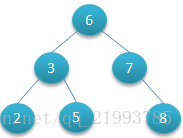 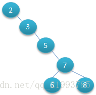

为了解决查找二叉树的查找效率问题，平衡二叉树(AVL Tree)就应运而生，其定义是在满足查找二叉树的一切要求下，还要额外满足**任意节点**的两个字数的高度差不超过1。创建过程先略。

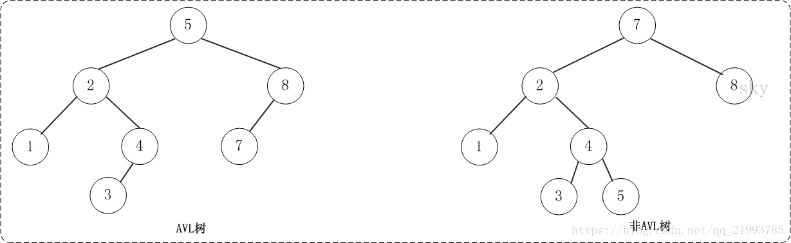

平衡多路查找树(B-Tree)是一个为磁盘IO优化的平衡查找树，系统从磁盘读取数据到内存时是以磁盘块（block）为基本单位的，所以要确保一个节点（一个block）包含的信息尽可能多。

一个m阶的平衡多路查找树需要满足:

- 每个节点最多m个孩子；
- 除根节点和叶子节点外，每个节点至少`ceil(m/2)`个孩子，其中Ceil是向上取整的意思，例如`ceil(300.15) = 310.0`；
- 如果根节点不是叶子节点，则至少有2个孩子；
- 所有叶子节点都在同一层，且不包含其它关键字信息；
- 每个非终端节点包含n个关键字信息，其中关键词n满足`ceil(m/2)-1 <= n <= m-1`；
- 关键词`ki, (i=1,...,n)`在一个块内是升序的；
- 子节点的指针为`Pi, (i=1,...,n)`，且`P(i-1)`指针指向的子树的所有节点关键字均小于`ki`，但都大于`k(i-1)`。

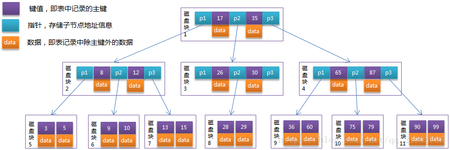

B+Tree是B-Tree的优化树，其为了更适合外部存储的一种结构，且InnoDB使用的就是B+Tree的索引结构。针对上面的B-Tree，可以看到的局限性是每个节点包含(关键词+指针+数据)，也就是说关键字占用了很多指针的空间，当在大数据量存储的过程中会导致B-Tree的深度更大，进而增加磁盘IO时间。所以：数据节点**都有序的存储在叶子节点**，非叶子节点只存储(关键词+指针)。

B+Tree于B-Tree的区别是
- 非叶子节点只存储键值信息；
- 所有叶子节点之间都有一个链指针；
- 数据记录都存放在叶子节点中；
- B+Tree叶节点的长度不一定相同。

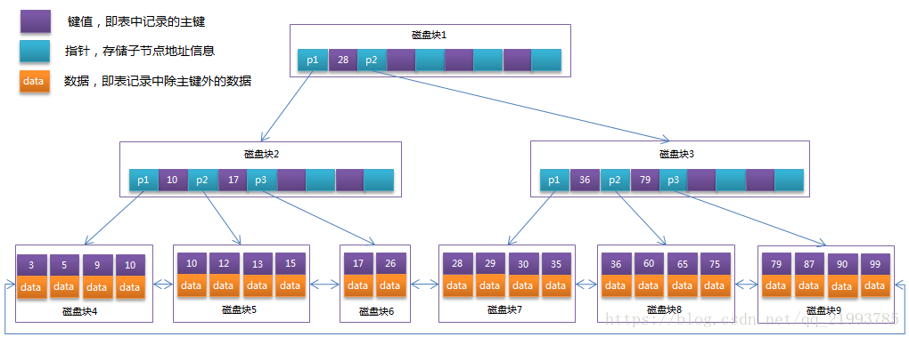

通常在B+Tree上有两个头指针，一个指向根节点，另一个指向关键字最小的叶子节点，而且所有叶子节点（即数据节点）之间是一种链式环结构。因此可以对B+Tree进行两种查找运算：一种是对于主键的范围查找和分页查找，另一种是从根节点开始，进行随机查找。

可能上面例子中只有22条数据记录，看不出B+Tree的优点，下面做一个推算：

InnoDB存储引擎中页的大小为16KB，一般表的主键类型为INT（占用4个字节）或BIGINT（占用8个字节），指针类型也一般为4或8个字节，也就是说一个页（B+Tree中的一个节点）中大概存储16KB/(8B+8B)=1K个键值（因为是估值，为方便计算，这里的K取值为〖10〗^3）。也就是说一个深度为3的B+Tree索引可以维护10^3 * 10^3 * 10^3 = 10亿 条记录。

实际情况中每个节点可能不能填充满，因此在数据库中，B+Tree的高度一般都在2~4层。**mysql的InnoDB存储引擎在设计时是将根节点常驻内存的**，也就是说查找某一键值的行记录时最多只需要1~3次磁盘I/O操作。

数据库中的B+Tree索引可以分为聚集索引（clustered index）和辅助索引（secondary index）。上面的B+Tree示例图在数据库中的实现即为聚集索引，聚集索引的B+Tree中的叶子**节点存放的是整张表的行记录数据**。辅助索引与聚集索引的区别在于辅助索引的叶子节点并**不包含行记录的全部数据，而是存储相应行数据的聚集索引键**，即主键。当通过辅助索引来查询数据时，InnoDB存储引擎会遍历辅助索引找到主键，然后再通过主键在聚集索引中找到完整的行记录数据。

## MyISAM与InnoDB的区别

> Ref: https://blog.csdn.net/qq_21993785/article/details/80582373

MyISAM引擎使用B+Tree作为索引结构，叶节点的data域存放的是数据记录的地址。所以针对主键的查询操作是: Primary Key -> 定位B+Tree叶子节点 -> 获取地址 -> 访问，针对非主键的查询操作是: Plain Key -> 定位B+Tree -> 获取地址 -> 访问。

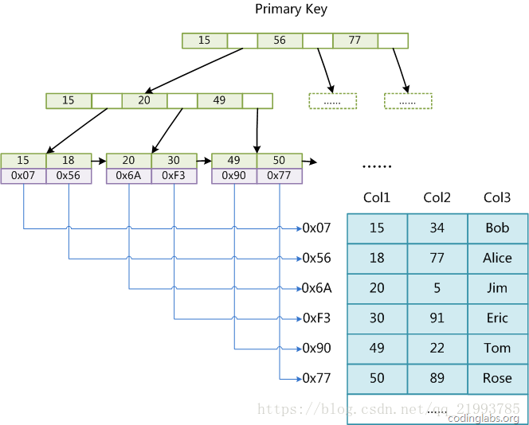

虽然InnoDB也使用B+Tree作为索引结构，但具体实现方式却与MyISAM截然不同。第一个重大区别是InnoDB的数据文件本身就是索引文件。从上文知道，MyISAM索引文件和数据文件是分离的，索引文件仅保存数据记录的地址。而在InnoDB中，表数据文件本身就是按B+Tree组织的一个索引结构，这棵树的叶节点data域保存了完整的数据记录。这个索引的key是数据表的主键，因此InnoDB表数据文件本身就是主索引。

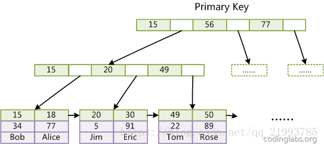

所以针对主键的查询操作是: Primary Key -> 定位B+Tree叶子节点 -> 获取数据，对于非主键（非聚集索引）的查询操作是: Plain Key -> 定位Plain Key的B+Tree叶子节点 -> 获取Primary Key -> 定位Primary Key的B+Tree叶子节点 -> 获取数据。

所以可以看到InnoDB在访问非聚集索引时，是访问了两次B+Tree的，所以读不如MyISAM快。

## ACID是什么？

> Ref: https://www.cnblogs.com/kismetv/p/10331633.html

ACID是原子性(Atomicity)、一致性(Consistency)、隔离性(Isolation)和持久性(Durability)的首字母。

### 原子性

原子性是指一个事务是一个不可分割的工作单位，其中的操作要么都做，要么都不做；如果事务中一个sql语句执行失败，则已执行的语句也必须回滚，数据库退回到事务前的状态。

在说明原子性原理之前，首先介绍一下MySQL的事务日志。MySQL的日志有很多种，如二进制日志、错误日志、查询日志、慢查询日志等，此外InnoDB存储引擎还提供了两种事务日志：redo log(重做日志)和undo log(回滚日志)。其中redo log用于保证事务持久性；undo log则是事务原子性和隔离性实现的基础。

下面说回undo log。实现原子性的关键，是当事务回滚时能够撤销所有已经成功执行的sql语句。InnoDB实现回滚，靠的是undo log：当事务对数据库进行修改时，InnoDB会生成对应的undo log；如果事务执行失败或调用了rollback，导致事务需要回滚，便可以利用undo log中的信息将数据回滚到修改之前的样子。

undo log属于逻辑日志，它记录的是sql执行相关的信息。当发生回滚时，InnoDB会根据undo log的内容做与之前相反的工作：对于每个insert，回滚时会执行delete；对于每个delete，回滚时会执行insert；对于每个update，回滚时会执行一个相反的update，把数据改回去。

以update操作为例：当事务执行update时，其生成的undo log中会包含被修改行的主键(以便知道修改了哪些行)、修改了哪些列、这些列在修改前后的值等信息，回滚时便可以使用这些信息将数据还原到update之前的状态。

### 持久性

这个借用REDO LOG，为了提高速度，所有操作先写入内存的Buffer Pool中，等一段时间后再集中写入磁盘中。因此读操作，先读Buffer Pool，如果没有在读硬盘中的内容。目前看来一切完美，但是有一种特殊情况，就是Buffer Pool中的数据没有写入磁盘中，MySQL就挂了，这样原来写入的操作就丢失了，因此需要借用REDO LOG，即修改的时候除了改Buffer Pool中的数据意外事件，还记录全部修改操作，这样在宕机之后可以恢复数据。

既然redo log也需要在事务提交时将日志写入磁盘，为什么它比直接将Buffer Pool中修改的数据写入磁盘(即刷脏)要快呢？主要有以下两方面的原因：
- 刷脏是随机IO，因为每次修改的数据位置随机，但写redo log是追加操作，属于顺序IO；
- 刷脏是以数据页（Page）为单位的，MySQL默认页大小是16KB，一个Page上一个小修改都要整页写入；而redo log中只包含真正需要写入的部分，无效IO大大减少。

### 隔离性

**与原子性、持久性侧重于研究事务本身不同，隔离性研究的是不同事务之间的相互影响。** 隔离性是指，事务内部的操作与其他事务是隔离的，并发执行的各个事务之间不能互相干扰。严格的隔离性，对应了事务隔离级别中的Serializable (可串行化)，但实际应用中出于性能方面的考虑很少会使用可串行化。

主要可以分为两个方面：
- (一个事务)写操作对(另一个事务)写操作的影响：锁机制保证隔离性
- (一个事务)写操作对(另一个事务)读操作的影响：MVCC保证隔离性

锁机制的基本原理可以概括为：事务在修改数据之前，需要先获得相应的锁；获得锁之后，事务便可以修改数据；该事务操作期间，这部分数据是锁定的，其他事务如果需要修改数据，需要等待当前事务提交或回滚后释放锁。

按照粒度，锁可以分为表锁、行锁以及其他位于二者之间的锁。表锁在操作数据时会锁定整张表，并发性能较差；行锁则只锁定需要操作的数据，并发性能好。但是由于加锁本身需要消耗资源(获得锁、检查锁、释放锁等都需要消耗资源)，因此在锁定数据较多情况下使用表锁可以节省大量资源。MySQL中不同的存储引擎支持的锁是不一样的，例如MyIsam只支持表锁，而InnoDB同时支持表锁和行锁，且出于性能考虑，绝大多数情况下使用的都是行锁。

#### 读操作的三种问题

在写入操作时可能会出现的三种问题:
- 脏读：当前事务(A)中可以读到其他事务(B)未提交的数据（脏数据），这种现象是脏读。
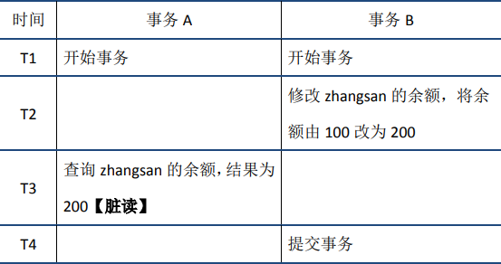
- 不可重复读：在事务A中先后两次读取同一个数据，两次读取的结果不一样，这种现象称为不可重复读。脏读与不可重复读的区别在于前者读到的是其他事务未提交的数据，后者读到的是其他事务已提交的数据。
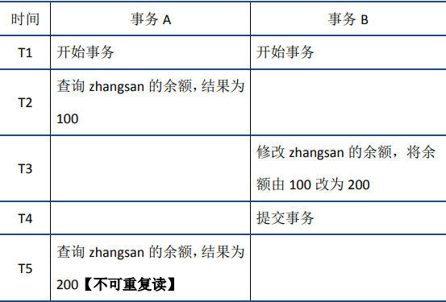
- 幻读：在事务A中按照某个条件先后两次查询数据库，两次查询结果的条数不同，这种现象称为幻读。不可重复读与幻读的区别可以通俗的理解为前者是数据变了，后者是数据的行数变了。
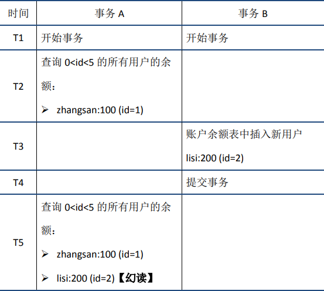

#### 隔离级别

隔离级别越低，系统开销越低，可支持的并发越高，但隔离性也越差。在实际应用中，读未提交在并发时会导致很多问题，而性能相对于其他隔离级别提高却很有限，因此使用较少。可串行化强制事务串行，并发效率很低，只有当对数据一致性要求极高且可以接受没有并发时使用，因此使用也较少。因此在大多数数据库系统中，默认的隔离级别是读已提交(如Oracle)或可重复读（后文简称RR）。

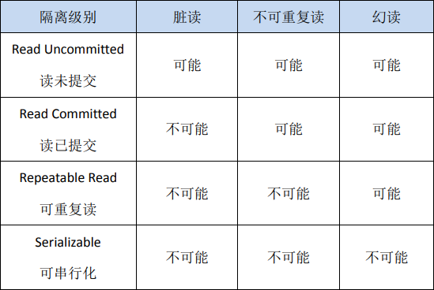

#### MVCC

可重复读(RR)解决脏读、不可重复读、幻读等问题，使用的是MVCC：MVCC全称Multi-Version Concurrency Control，即多版本的并发控制协议。**MVCC最大的优点是读不加锁**，因此读写不冲突，并发性能好。实现MVCC的结构包括:
- 隐藏列：InnoDB中每行数据都有隐藏列，隐藏列中包含了本行数据的事务id、指向undo log的指针等。
- 基于undo log的版本链：前面说到每行数据的隐藏列中包含了指向undo log的指针，而每条undo log也会指向更早版本的undo log，从而形成一条版本链。
- ReadView：通过隐藏列和版本链，MySQL可以将数据恢复到指定版本；但是具体要恢复到哪个版本，则需要根据ReadView来确定。所谓ReadView，是指事务（记做事务A）在某一时刻给整个事务系统（trx_sys）打快照，之后再进行读操作时，会将读取到的数据中的事务id与trx_sys快照比较，从而判断数据对该ReadView是否可见，即对事务A是否可见。
  - low_limit_id：表示生成ReadView时系统中应该分配给下一个事务的id。如果数据的事务id大于等于low_limit_id，则对该ReadView不可见。
  - up_limit_id：表示生成ReadView时当前系统中活跃的读写事务中最小的事务id。如果数据的事务id小于up_limit_id，则对该ReadView可见。
  - rw_trx_ids：表示生成ReadView时当前系统中活跃的读写事务的事务id列表。如果数据的事务id在low_limit_id和up_limit_id之间，则需要判断事务id是否在rw_trx_ids中：如果在，说明生成ReadView时事务仍在活跃中，因此数据对ReadView不可见；如果不在，说明生成ReadView时事务已经提交了，因此数据对ReadView可见。

对于脏读问题，因为事物B还没有提交，所以对于事物A来说事物B的一定是不可见的。事务A根据指针指向的undo log查询上一版本的数据，得到zhangsan的余额为100。这样事务A就避免了脏读

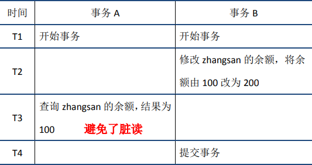

对于不可重复读问题，当事务A在T2时刻读取zhangsan的余额前，会生成ReadView。此时事务B分两种情况讨论，一种是如图中所示，事务已经开始但没有提交，此时其事务id在ReadView的rw_trx_ids中；一种是事务B还没有开始，此时其事务id大于等于ReadView的low_limit_id。无论是哪种情况，根据前面介绍的规则，事务B的修改对ReadView都不可见。

当事务A在T5时刻再次读取zhangsan的余额时，会根据T2时刻生成的ReadView对数据的可见性进行判断，从而判断出事务B的修改不可见；因此事务A根据指针指向的undo log查询上一版本的数据，得到zhangsan的余额为100，从而避免了不可重复读。


当事务A在T2时刻读取`0<id<5`的用户余额前，会生成ReadView。此时事务B分两种情况讨论，一种是如图中所示，事务已经开始但没有提交，此时其事务id在ReadView的rw_trx_ids中；一种是事务B还没有开始，此时其事务id大于等于ReadView的low_limit_id。无论是哪种情况，根据前面介绍的规则，事务B的修改对ReadView都不可见。

当事务A在T5时刻再次读取0<id<5的用户余额时，会根据T2时刻生成的ReadView对数据的可见性进行判断，从而判断出事务B的修改不可见。因此对于新插入的数据lisi(id=2)，事务A根据其指针指向的undo log查询上一版本的数据，发现该数据并不存在，从而避免了幻读。

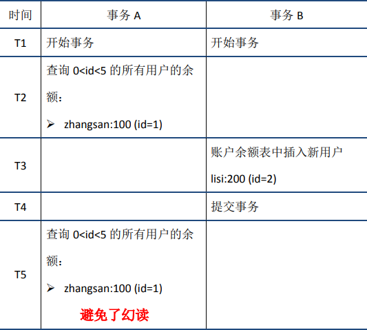

### 一致性

一致性是指事务执行结束后，数据库的完整性约束没有被破坏，事务执行的前后都是合法的数据状态。数据库的完整性约束包括但不限于：实体完整性（如行的主键存在且唯一）、列完整性（如字段的类型、大小、长度要符合要求）、外键约束、用户自定义完整性（如转账前后，两个账户余额的和应该不变）。

## 索引设计原则

> Ref: https://www.kancloud.cn/hx78/sql/333932

**选择唯一性索引**：唯一性索引的值是唯一的，可以更快速的通过该索引来确定某条记录。
  
**为经常需要排序、分组和联合操作的字段建立索引**：经常需要ORDER BY、GROUP BY、DISTINCT和UNION等操作的字段，排序操作会浪费很多时间。如果为其建立索引，可以有效地避免排序操作。 

**为常作为查询条件的字段建立索引**：如果某个字段经常用来做查询条件，那么该字段的查询速度会影响整个表的查询速度。因此，为这样的字段建立索引，可以提高整个表的查询速度。

**限制索引的数目**：索引的数目不是越多越好。每个索引都需要占用磁盘空间，索引越多，需要的磁盘空间就越大。修改表时，对索引的重构和更新很麻烦。越多的索引，会使更新表变得很浪费时间。

**尽量使用数据量少的索引**：如果索引的值很长，那么查询的速度会受到影响。例如，对一个CHAR（100）类型的字段进行全文。检索需要的时间肯定要比对CHAR（10）类型的字段需要的时间要多。

**删除不再使用或者很少使用的索引**：表中的数据被大量更新，或者数据的使用方式被改变后，原有的一些索引可能不再需要。数据库管理员应当定期找出这些索引，将它们删除，从而减少索引对更新操作的影响。

## 你是怎么为数据库选主键的

不是很清楚这个题想要考察什么？

## 复合索引索引选择

> Refs: 
> - https://my.oschina.net/u/945573/blog/2985834
> - https://segmentfault.com/a/1190000015416513

- 最左侧原则
- 一起出现的查询条件要选择为复合索引

## 索引失效

> Ref: https://blog.csdn.net/wuseyukui/article/details/72312574

- 最左侧原则
- 不要在索引上做任何操作（计算、函数、自动/手动类型转换），不然会导致索引失效而转向全表扫描
- mysql存储引擎不能继续使用索引中范围条件（bettween、<、>、in等）右边的列
- 尽量使用覆盖索引（只查询索引的列（索引列和查询列一致）），减少select *，这样做的目的是为了防止回表
- 索引字段上使用（！= 或者 < >）判断时，会导致索引失效而转向全表扫描
- 索引字段上使用 is null / is not null 判断时，会导致索引失效而转向全表扫描
- 索引字段使用like以通配符开头（‘%字符串’）时，会导致索引失效而转向全表扫描
- 索引字段是字符串，但查询时不加单引号，会导致索引失效而转向全表扫描
- 索引字段使用 or 时，会导致索引失效而转向全表扫描

## LEFT JOIN, RIGHT JOIN, INNER JOIN

> Refs: 
> - https://www.huaweicloud.com/articles/da9a938f6012153cad1e0a0f6d78c03e.html
> - https://www.cnblogs.com/qdhxhz/p/10897315.html

left join(左联接) 返回包括左表中的所有记录和右表中联结字段相等的记录；
right join(右联接) 返回包括右表中的所有记录和左表中联结字段相等的记录；
inner join(等值连接) 只返回两个表中联结字段相等的行。

如果Left Join和Right Join有一对多的问题时，会返回多行。

```
--- TABLEA
aid, name
1, foo
2, bar

--- TABLEB
bid, aid, price
1, 1, 100
2, 1, 200
3, 2, 300
```

在执行

```sql
SELECT * FROM TABLEA LEFT JOIN TABLEB ON TABLEA.aid = TABLEB.aid;
```

会返回的数据为

```
1, foo, 1, 1, 100
1, foo, 2, 1, 200
2, bar, 3, 2, 300
```

## 查询优化慢查询

略

## mysql的三大Log

略
